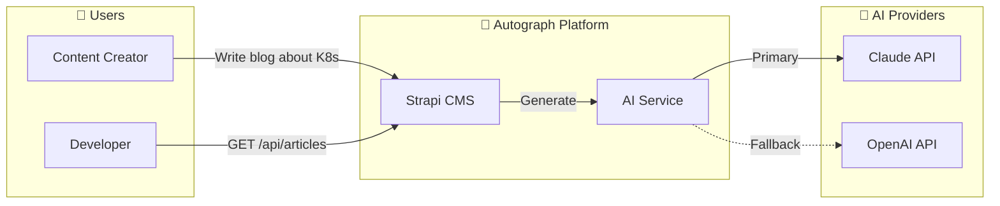
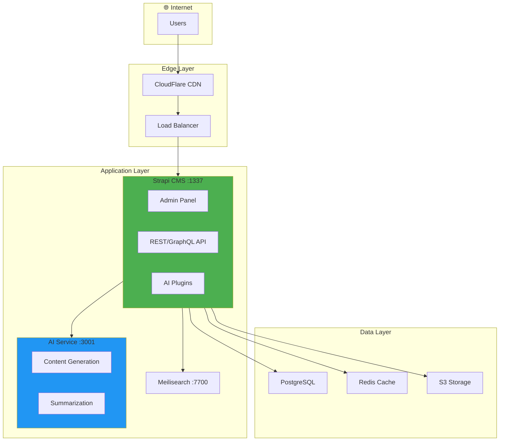
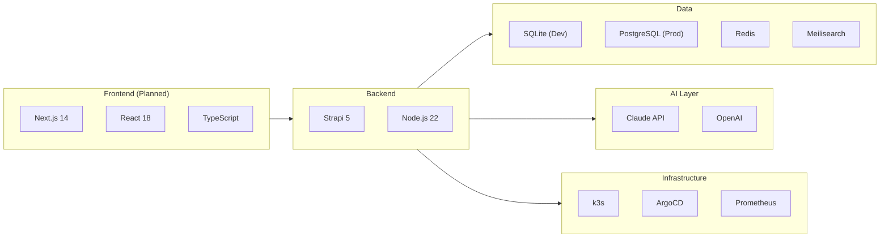
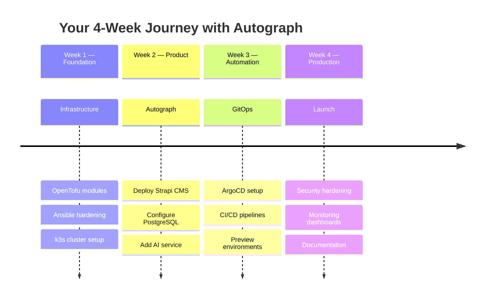

# Autograph

> **AI-Powered Content Platform** — Strapi CMS meets Claude/OpenAI

[](https://strapi.io)
[](https://nodejs.org)
[](LICENSE)

---

## 🎯 What is Autograph?

Autograph is an AI-powered content platform that helps creators and businesses **generate, manage, and distribute content at scale**. Built as part of the PearlThoughts DevOps Internship Program, it demonstrates production-grade infrastructure practices.



### Key Features

| Feature | Description | Status |
|---------|-------------|--------|
| 🤖 **AI Content Generation** | Generate articles, summaries, SEO metadata | 🟡 Planned |
| 📝 **Headless CMS** | Strapi 5 with REST/GraphQL APIs | ✅ Ready |
| 🔍 **Smart Search** | Meilisearch integration | 🟡 Planned |
| ⚡ **Caching** | Redis for performance | 🟡 Planned |
| 🎨 **Frontend** | Next.js dashboard | 🟡 Planned |

---

## 🏗️ Architecture Overview



---

## 🚀 Quick Start

### Prerequisites

| Tool | Version | Installation |
|------|---------|--------------|
| **Node.js** | 20.x - 24.x | `fnm install 22` or [nodejs.org](https://nodejs.org) |
| **npm** | 8.x+ | Comes with Node.js |
| **Git** | 2.x+ | `brew install git` |

### 1. Clone & Install

```bash
# Clone the repository
git clone git@github.com:PearlThoughtsInternship/Autograph.git
cd Autograph

# Switch to correct Node version (if using fnm)
fnm use 22

# Install dependencies
cd backend
npm install
```

### 2. Build & Run

```bash
# Build the admin panel (required first time)
npm run build

# Start development server
npm run develop
```

### 3. Access

| URL | Description |
|-----|-------------|
| http://localhost:1337/admin | 📊 Admin Panel (create your first user) |
| http://localhost:1337/api | 🔌 REST API |
| http://localhost:1337/_health | ❤️ Health Check |

> 💡 **First Run:** You'll be prompted to create an admin user. This is your superuser account.

---

## 📚 Documentation

| Document | Description | Audience |
|----------|-------------|----------|
| [📖 Local Setup Guide](docs/LOCAL-SETUP.md) | Detailed local development setup | All Interns |
| [🔧 Troubleshooting](docs/TROUBLESHOOTING.md) | Common issues and solutions | All Interns |
| [☁️ Cloud Deployment](docs/CLOUD-DEPLOYMENT.md) | Promoting to Hetzner/AWS | DevOps Interns |
| [📚 Learning Path](docs/LEARNING-PATH.md) | Curated learning resources | All Interns |
| [📋 Product Vision](/.github/specs/001-product-vision.md) | Product requirements | All |
| [⚙️ Capabilities](/.github/specs/002-capabilities.md) | Feature specifications | All |
| [🏛️ Architecture](/.github/specs/003-architecture.md) | Technical architecture | DevOps |

---

## 🛠️ Tech Stack



| Layer | Technology | Why |
|-------|------------|-----|
| **CMS** | Strapi 5 | Open source, API-first, extensible |
| **Runtime** | Node.js 22 | LTS, modern JavaScript |
| **Database (Dev)** | SQLite | Zero configuration |
| **Database (Prod)** | PostgreSQL 15 | Production-grade, JSON support |
| **AI Primary** | Claude API | Best content quality |
| **AI Fallback** | OpenAI API | Reliability |
| **Search** | Meilisearch | Fast, typo-tolerant |
| **Cache** | Redis | Performance, sessions |
| **Container** | Docker | Consistency |
| **Orchestration** | k3s | Lightweight Kubernetes |
| **GitOps** | ArgoCD | Declarative deployments |
| **Monitoring** | Prometheus + Grafana | Observability |

---

## 📁 Project Structure

```
Autograph/
├── backend/                    # Strapi CMS Application
│   ├── config/                 # Strapi configuration
│   │   ├── admin.ts           # Admin panel config
│   │   ├── api.ts             # API configuration
│   │   ├── database.ts        # Database connection
│   │   ├── middlewares.ts     # Middleware stack
│   │   ├── plugins.ts         # Plugin configuration
│   │   └── server.ts          # Server settings
│   ├── src/
│   │   ├── api/               # Content-type APIs (auto-generated)
│   │   ├── components/        # Reusable components
│   │   ├── extensions/        # Core extensions
│   │   └── plugins/           # Custom plugins
│   ├── database/              # SQLite database (gitignored)
│   ├── public/                # Static assets
│   ├── types/                 # TypeScript types
│   └── package.json
│
├── tests/                      # Integration tests
│   └── health.test.ts         # Health check tests
│
├── docs/                       # Documentation
│   ├── LOCAL-SETUP.md         # Local development guide
│   ├── TROUBLESHOOTING.md     # Common issues
│   ├── CLOUD-DEPLOYMENT.md    # Cloud deployment guide
│   └── LEARNING-PATH.md       # Learning resources
│
├── .github/
│   └── specs/                 # Product specifications
│       ├── 001-product-vision.md
│       ├── 002-capabilities.md
│       └── 003-architecture.md
│
├── k8s/                       # Kubernetes manifests (coming soon)
├── .gitignore
└── README.md
```

---

## 🎓 For Interns

This project is part of the **PearlThoughts DevOps Internship Program**. You're not just learning DevOps—you're **building a startup**.

### Your Journey



### Key Learning Outcomes

By the end of this project, you will:

- ✅ Deploy a production-grade headless CMS
- ✅ Configure persistent storage with proper backup strategies
- ✅ Implement GitOps workflows with ArgoCD
- ✅ Set up comprehensive monitoring with Prometheus/Grafana
- ✅ Apply security best practices (RBAC, Network Policies)
- ✅ Understand cost optimization (Hetzner vs AWS)

### Cost Comparison

| Component | Hetzner | AWS | Savings |
|-----------|---------|-----|---------|
| 3x Server VMs | €30/mo | $180+/mo | 83% |
| 3x Worker VMs | €60/mo | $360+/mo | 83% |
| Load Balancer | €6/mo | $20+/mo | 70% |
| Bandwidth (20TB) | €0 | $1,800/mo | 100% |
| **Total** | **€101/mo** | **$2,370/mo** | **96%** |

---

## 🧪 Testing

```bash
# Run tests (requires Strapi to be running)
cd backend
npm test

# Or with the server in development mode
npm run develop &
npm test
```

---

## 🤝 Contributing

1. Create a feature branch: `git checkout -b feat/amazing-feature`
2. Make your changes
3. Run tests: `npm test`
4. Commit: `git commit -m "feat: Add amazing feature"`
5. Push: `git push origin feat/amazing-feature`
6. Open a Pull Request

### Commit Convention

We use [Conventional Commits](https://www.conventionalcommits.org/):

| Prefix | Description |
|--------|-------------|
| `feat:` | New feature |
| `fix:` | Bug fix |
| `docs:` | Documentation |
| `refactor:` | Code refactoring |
| `test:` | Tests |
| `chore:` | Maintenance |

---

## 📞 Support

- **Slack:** #devops-internship
- **Email:** internship@pearlthoughts.com
- **Documentation:** [Internship Vault](https://github.com/PearlThoughtsInternship)

---

## 📄 License

Proprietary - PearlThoughts Internship Program

---

<div align="center">

**Built with ❤️ by PearlThoughts Interns**

[Documentation](docs/) · [Issues](https://github.com/PearlThoughtsInternship/Autograph/issues) · [Specifications](.github/specs/)

</div>
