# Cloud Deployment Guide

> **Audience:** DevOps Interns
> **Difficulty:** Intermediate to Advanced
> **Time Required:** 2-4 hours (initial setup)

This guide covers promoting Autograph from local development to production infrastructure.

---

## Table of Contents

1. [Deployment Philosophy](#deployment-philosophy)
2. [Infrastructure Overview](#infrastructure-overview)
3. [Hetzner Cloud Setup](#hetzner-cloud-setup)
4. [AWS Setup (Alternative)](#aws-setup-alternative)
5. [Kubernetes Deployment](#kubernetes-deployment)
6. [Database Migration](#database-migration)
7. [CI/CD Pipeline](#cicd-pipeline)
8. [Monitoring & Observability](#monitoring--observability)
9. [Cost Optimization](#cost-optimization)
10. [Security Checklist](#security-checklist)

---

## Deployment Philosophy


### GitOps Workflow

We use **GitOps** with ArgoCD:

1. **Infrastructure as Code** — All infrastructure defined in OpenTofu/Terraform
2. **Declarative Deployments** — Kubernetes manifests in Git
3. **Automated Sync** — ArgoCD watches Git and applies changes
4. **Pull-based** — Cluster pulls changes (more secure than push)

---

## Infrastructure Overview

### Target Architecture

```mermaid
flowchart TB
    subgraph Internet["🌐 Internet"]
        Users["Users"]
        DNS["CloudFlare DNS"]
    end

    subgraph Edge["Edge Layer"]
        LB["Hetzner Load Balancer\n€5.99/mo"]
    end

    subgraph K3s["k3s Cluster"]
        subgraph ControlPlane["Control Plane (3x CX22)"]
            CP1["Server 1\n€4.59/mo"]
            CP2["Server 2\n€4.59/mo"]
            CP3["Server 3\n€4.59/mo"]
        end

        subgraph Workers["Worker Nodes (3x CX32)"]
            W1["Worker 1\n€9.59/mo"]
            W2["Worker 2\n€9.59/mo"]
            W3["Worker 3\n€9.59/mo"]
        end

        subgraph Workloads["Workloads"]
            Strapi["Strapi CMS"]
            AI["AI Service"]
            Search["Meilisearch"]
        end
    end

    subgraph Data["Data Layer"]
        PG["PostgreSQL\n(Managed or Self-hosted)"]
        Redis["Redis"]
        S3["S3-Compatible Storage\n(MinIO or Hetzner)"]
    end

    Users --> DNS --> LB --> K3s
    Strapi --> PG
    Strapi --> Redis
    Strapi --> S3

    style K3s fill:#326CE5
```



### Component Mapping

| Component | Local | Staging | Production |
|-----------|-------|---------|------------|
| **CMS** | Strapi (SQLite) | Strapi (PostgreSQL) | Strapi (PostgreSQL HA) |
| **Database** | SQLite file | PostgreSQL single | PostgreSQL cluster |
| **Cache** | None | Redis single | Redis Sentinel |
| **Search** | None | Meilisearch | Meilisearch cluster |
| **Storage** | Local disk | MinIO | Hetzner Object Storage |
| **Orchestration** | Docker Compose | k3s single | k3s HA cluster |

---

## Hetzner Cloud Setup

### Why Hetzner?

| Factor | Hetzner | AWS | Savings |
|--------|---------|-----|---------|
| 3x Control Plane (2 vCPU, 4GB) | €13.77/mo | $54+/mo | 75% |
| 3x Workers (4 vCPU, 8GB) | €28.77/mo | $162+/mo | 82% |
| Load Balancer | €5.99/mo | $20+/mo | 70% |
| 20TB Bandwidth | €0 | $1,800/mo | 100% |
| **Total** | **€48.53/mo** | **$2,036+/mo** | **97%** |

### Step 1: Create Hetzner Account

1. Go to [hetzner.com/cloud](https://www.hetzner.com/cloud)
2. Create account and verify email
3. Add payment method
4. Create a new project: "Autograph"

### Step 2: Generate API Token

```bash
# Store in environment (add to .zshrc)
export HCLOUD_TOKEN="your-token-here"

# Verify
hcloud server-type list
```

### Step 3: Infrastructure with OpenTofu

```hcl
# infrastructure/main.tf

terraform {
  required_providers {
    hcloud = {
      source  = "hetznercloud/hcloud"
      version = "~> 1.45"
    }
  }
}

provider "hcloud" {
  token = var.hcloud_token
}

# Network
resource "hcloud_network" "k3s" {
  name     = "k3s-network"
  ip_range = "10.0.0.0/8"
}

resource "hcloud_network_subnet" "k3s" {
  network_id   = hcloud_network.k3s.id
  type         = "cloud"
  network_zone = "eu-central"
  ip_range     = "10.0.1.0/24"
}

# Control Plane Nodes
resource "hcloud_server" "control_plane" {
  count       = 3
  name        = "k3s-server-${count.index + 1}"
  server_type = "cx22"
  image       = "ubuntu-24.04"
  location    = "fsn1"

  network {
    network_id = hcloud_network.k3s.id
  }

  labels = {
    role = "control-plane"
  }
}

# Worker Nodes
resource "hcloud_server" "worker" {
  count       = 3
  name        = "k3s-worker-${count.index + 1}"
  server_type = "cx32"
  image       = "ubuntu-24.04"
  location    = "fsn1"

  network {
    network_id = hcloud_network.k3s.id
  }

  labels = {
    role = "worker"
  }
}

# Load Balancer
resource "hcloud_load_balancer" "ingress" {
  name               = "k3s-ingress"
  load_balancer_type = "lb11"
  location           = "fsn1"
}
```

### Step 4: Deploy Infrastructure

```bash
cd infrastructure

# Initialize
tofu init

# Plan
tofu plan -out=tfplan

# Apply
tofu apply tfplan
```

---

## AWS Setup (Alternative)

### When to Choose AWS

| Choose Hetzner | Choose AWS |
|----------------|------------|
| Cost is primary concern | Need managed services |
| EU data residency required | Global edge locations |
| Predictable workloads | Burst capacity needed |
| Simple infrastructure | Complex integrations |

### AWS Architecture


### Terraform for AWS

```hcl
# infrastructure/aws/main.tf

module "vpc" {
  source  = "terraform-aws-modules/vpc/aws"
  version = "~> 5.0"

  name = "autograph-vpc"
  cidr = "10.0.0.0/16"

  azs             = ["eu-west-1a", "eu-west-1b", "eu-west-1c"]
  private_subnets = ["10.0.1.0/24", "10.0.2.0/24", "10.0.3.0/24"]
  public_subnets  = ["10.0.101.0/24", "10.0.102.0/24", "10.0.103.0/24"]

  enable_nat_gateway = true
  single_nat_gateway = true  # Cost optimization for non-prod
}

module "eks" {
  source  = "terraform-aws-modules/eks/aws"
  version = "~> 20.0"

  cluster_name    = "autograph"
  cluster_version = "1.29"

  vpc_id     = module.vpc.vpc_id
  subnet_ids = module.vpc.private_subnets

  eks_managed_node_groups = {
    main = {
      instance_types = ["t3.medium"]
      min_size       = 2
      max_size       = 5
      desired_size   = 3
    }
  }
}
```

---

## Kubernetes Deployment

### Directory Structure

```
k8s/
├── base/
│   ├── namespace.yaml
│   ├── strapi/
│   │   ├── deployment.yaml
│   │   ├── service.yaml
│   │   ├── configmap.yaml
│   │   └── secrets.yaml
│   ├── postgresql/
│   │   └── ...
│   └── redis/
│       └── ...
├── overlays/
│   ├── staging/
│   │   └── kustomization.yaml
│   └── production/
│       └── kustomization.yaml
└── argocd/
    └── application.yaml
```

### Strapi Deployment

```yaml
# k8s/base/strapi/deployment.yaml
apiVersion: apps/v1
kind: Deployment
metadata:
  name: strapi
  namespace: autograph
spec:
  replicas: 2
  selector:
    matchLabels:
      app: strapi
  template:
    metadata:
      labels:
        app: strapi
    spec:
      containers:
        - name: strapi
          image: ghcr.io/pearlthoughtsinternship/autograph:latest
          ports:
            - containerPort: 1337
          envFrom:
            - configMapRef:
                name: strapi-config
            - secretRef:
                name: strapi-secrets
          resources:
            requests:
              memory: "512Mi"
              cpu: "250m"
            limits:
              memory: "1Gi"
              cpu: "500m"
          livenessProbe:
            httpGet:
              path: /_health
              port: 1337
            initialDelaySeconds: 30
            periodSeconds: 10
          readinessProbe:
            httpGet:
              path: /_health
              port: 1337
            initialDelaySeconds: 5
            periodSeconds: 5
```

### ArgoCD Application

```yaml
# k8s/argocd/application.yaml
apiVersion: argoproj.io/v1alpha1
kind: Application
metadata:
  name: autograph
  namespace: argocd
spec:
  project: default
  source:
    repoURL: https://github.com/PearlThoughtsInternship/Autograph.git
    targetRevision: main
    path: k8s/overlays/production
  destination:
    server: https://kubernetes.default.svc
    namespace: autograph
  syncPolicy:
    automated:
      prune: true
      selfHeal: true
    syncOptions:
      - CreateNamespace=true
```

---

## Database Migration

### SQLite to PostgreSQL


### Configuration Changes

```typescript
// config/database.ts
export default ({ env }) => {
  const client = env('DATABASE_CLIENT', 'sqlite');

  const connections = {
    sqlite: {
      connection: {
        filename: env('DATABASE_FILENAME', '.tmp/data.db'),
      },
      useNullAsDefault: true,
    },
    postgres: {
      connection: {
        host: env('DATABASE_HOST', 'localhost'),
        port: env.int('DATABASE_PORT', 5432),
        database: env('DATABASE_NAME', 'strapi'),
        user: env('DATABASE_USERNAME', 'strapi'),
        password: env('DATABASE_PASSWORD', ''),
        ssl: env.bool('DATABASE_SSL', false) && {
          rejectUnauthorized: env.bool('DATABASE_SSL_REJECT_UNAUTHORIZED', true),
        },
      },
      pool: {
        min: env.int('DATABASE_POOL_MIN', 2),
        max: env.int('DATABASE_POOL_MAX', 10),
      },
    },
  };

  return {
    connection: {
      client,
      ...connections[client],
    },
  };
};
```

### Environment Variables for Production

```bash
# Production .env (stored in secrets management)
DATABASE_CLIENT=postgres
DATABASE_HOST=postgresql.autograph.svc.cluster.local
DATABASE_PORT=5432
DATABASE_NAME=strapi
DATABASE_USERNAME=strapi
DATABASE_PASSWORD=${POSTGRES_PASSWORD}  # From secret
DATABASE_SSL=true
```

---

## CI/CD Pipeline

### GitHub Actions Workflow

```yaml
# .github/workflows/deploy.yml
name: Deploy

on:
  push:
    branches: [main]
  pull_request:
    branches: [main]

env:
  REGISTRY: ghcr.io
  IMAGE_NAME: ${{ github.repository }}

jobs:
  build:
    runs-on: ubuntu-latest
    outputs:
      image-tag: ${{ steps.meta.outputs.tags }}

    steps:
      - uses: actions/checkout@v4

      - name: Set up Docker Buildx
        uses: docker/setup-buildx-action@v3

      - name: Login to Container Registry
        uses: docker/login-action@v3
        with:
          registry: ${{ env.REGISTRY }}
          username: ${{ github.actor }}
          password: ${{ secrets.GITHUB_TOKEN }}

      - name: Extract metadata
        id: meta
        uses: docker/metadata-action@v5
        with:
          images: ${{ env.REGISTRY }}/${{ env.IMAGE_NAME }}
          tags: |
            type=sha,prefix=
            type=ref,event=branch

      - name: Build and push
        uses: docker/build-push-action@v5
        with:
          context: ./backend
          push: true
          tags: ${{ steps.meta.outputs.tags }}
          cache-from: type=gha
          cache-to: type=gha,mode=max

  deploy-staging:
    needs: build
    runs-on: ubuntu-latest
    environment: staging

    steps:
      - name: Deploy to staging
        run: |
          # ArgoCD will auto-sync from Git
          echo "Deployed to staging"

  deploy-production:
    needs: deploy-staging
    runs-on: ubuntu-latest
    environment: production
    if: github.ref == 'refs/heads/main'

    steps:
      - name: Deploy to production
        run: |
          # Requires manual approval in GitHub
          echo "Deployed to production"
```

---

## Monitoring & Observability

### Stack Overview


### Key Metrics to Monitor

| Metric | Warning | Critical |
|--------|---------|----------|
| **Response time (p99)** | > 500ms | > 2s |
| **Error rate** | > 1% | > 5% |
| **CPU usage** | > 70% | > 90% |
| **Memory usage** | > 80% | > 95% |
| **Database connections** | > 80% pool | > 95% pool |
| **Disk usage** | > 70% | > 85% |

### Grafana Dashboard

Create dashboards for:

1. **Overview** — Request rate, error rate, latency
2. **Infrastructure** — Node health, resource usage
3. **Database** — Query performance, connections
4. **Business** — Content created, API usage

---

## Cost Optimization

### Hetzner Monthly Costs

| Resource | Spec | Monthly |
|----------|------|---------|
| 3x Control Plane | CX22 (2 vCPU, 4GB) | €13.77 |
| 3x Workers | CX32 (4 vCPU, 8GB) | €28.77 |
| Load Balancer | LB11 | €5.99 |
| Volumes | 100GB SSD | €4.80 |
| Object Storage | 100GB | €2.72 |
| Bandwidth | 20TB included | €0 |
| **Total** | | **€56.05/mo** |

### Cost Reduction Strategies

1. **Start small** — Begin with 1 control plane, 2 workers
2. **Spot instances** — Use for non-critical workloads
3. **Reserved instances** — 20-30% savings for committed usage
4. **Right-sizing** — Monitor and adjust resource allocation
5. **Autoscaling** — Scale down during low traffic

---

## Security Checklist

### Before Production

```
□ NETWORK     → Network policies restrict pod-to-pod traffic
□ SECRETS     → All secrets in external secrets manager (Vault/SOPS)
□ RBAC        → Kubernetes RBAC configured, no cluster-admin
□ TLS         → All traffic encrypted (cert-manager + Let's Encrypt)
□ IMAGES      → Images scanned for vulnerabilities (Trivy)
□ POLICIES    → Pod Security Standards enforced
□ BACKUP      → Database backup strategy tested
□ LOGGING     → Audit logging enabled
□ ACCESS      → SSH keys rotated, bastion host configured
□ UPDATES     → Automatic security updates enabled
```

### Security Tools

| Tool | Purpose |
|------|---------|
| **cert-manager** | TLS certificate automation |
| **external-secrets** | Secrets management |
| **Trivy** | Container vulnerability scanning |
| **Falco** | Runtime security monitoring |
| **NetworkPolicies** | Network segmentation |

---

## Deployment Checklist

### Pre-Deployment

```
□ INFRA       → Infrastructure provisioned and tested
□ CLUSTER     → k3s cluster healthy (kubectl get nodes)
□ ARGOCD      → ArgoCD installed and configured
□ SECRETS     → All secrets created in cluster
□ DATABASE    → PostgreSQL provisioned and accessible
□ STORAGE     → Object storage configured
□ DNS         → Domain configured in CloudFlare
□ TLS         → Certificates issued
```

### Deployment

```
□ BUILD       → Docker image built and pushed
□ MANIFESTS   → Kubernetes manifests updated
□ DEPLOY      → ArgoCD synced successfully
□ VERIFY      → Health checks passing
□ SMOKE       → Manual smoke tests passed
□ MONITOR     → Dashboards showing data
```

### Post-Deployment

```
□ BACKUP      → First backup completed
□ ALERTS      → Alert channels configured
□ DOCS        → Runbooks updated
□ HANDOFF     → Team notified of deployment
```

---

<div align="center">

**Ready for Production?** Work through this checklist with your mentor

[Back to README](../README.md) · [Troubleshooting](TROUBLESHOOTING.md) · [Learning Path](LEARNING-PATH.md)

</div>
