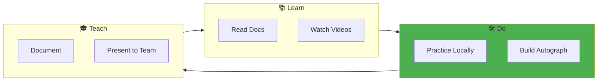
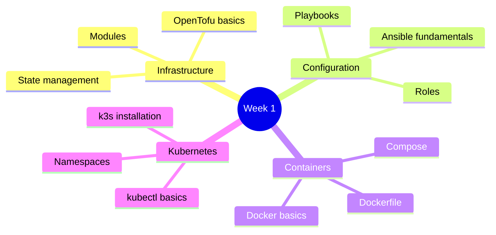
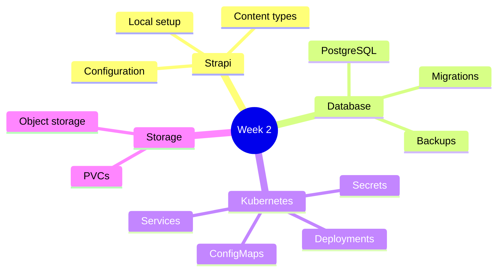
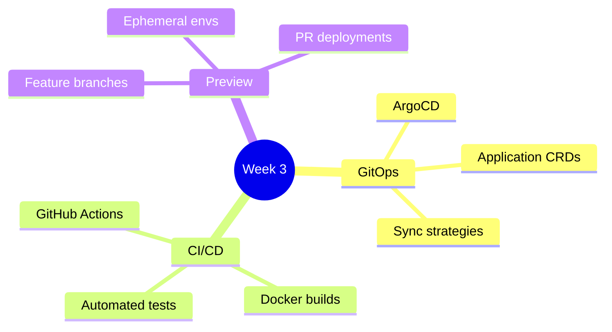
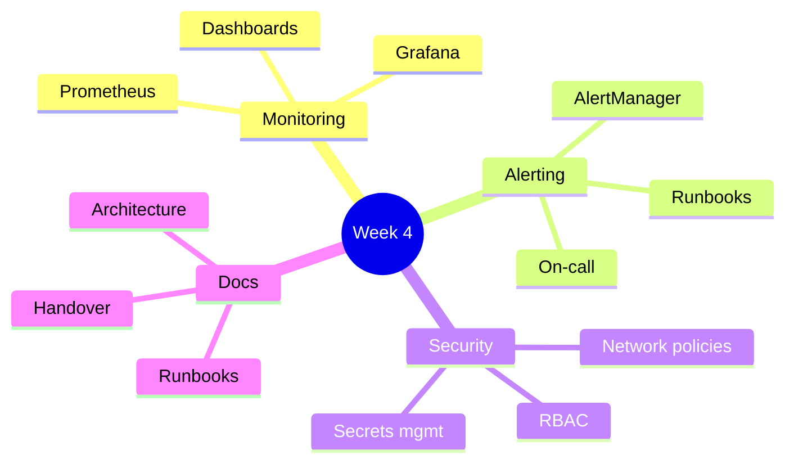
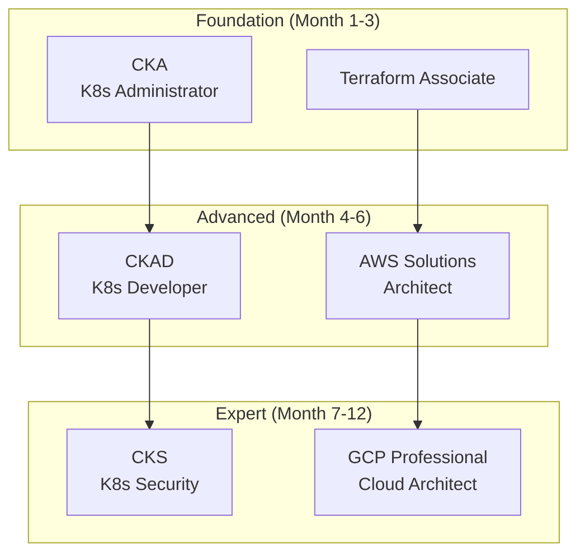

# Learning Path for DevOps Interns

> **Audience:** DevOps Interns
> **Duration:** 4 weeks
> **Format:** Self-paced with mentor check-ins

This curated learning path aligns with the Autograph project and DevOps internship goals.

---

## Table of Contents

1. [Learning Philosophy](#learning-philosophy)
2. [Week 1: Foundation](#week-1-foundation)
3. [Week 2: Product Deployment](#week-2-product-deployment)
4. [Week 3: Automation & GitOps](#week-3-automation--gitops)
5. [Week 4: Production Readiness](#week-4-production-readiness)
6. [Deep Dive Topics](#deep-dive-topics)
7. [Certification Paths](#certification-paths)
8. [Resources Library](#resources-library)

---

## Learning Philosophy



### The 70-20-10 Rule

| Percentage | Activity | Example |
|------------|----------|---------|
| **70%** | Hands-on work | Deploy Autograph to k3s |
| **20%** | Learn from others | Pair programming, code reviews |
| **10%** | Formal learning | Courses, documentation |

---

## Week 1: Foundation

### Goals

- [ ] Understand infrastructure as code concepts
- [ ] Set up local development environment
- [ ] Deploy first k3s cluster
- [ ] Complete Ansible hardening

### Topics



### Learning Resources

#### Infrastructure as Code

| Resource | Type | Time | Link |
|----------|------|------|------|
| Terraform Tutorial | Interactive | 2h | [HashiCorp Learn](https://developer.hashicorp.com/terraform/tutorials) |
| OpenTofu Docs | Documentation | 1h | [opentofu.org](https://opentofu.org/docs/) |
| IaC Best Practices | Article | 30m | [Gruntwork Guide](https://blog.gruntwork.io/a-comprehensive-guide-to-terraform-b3d32832baca) |

#### Ansible

| Resource | Type | Time | Link |
|----------|------|------|------|
| Ansible Getting Started | Docs | 1h | [Ansible Docs](https://docs.ansible.com/ansible/latest/getting_started/) |
| Ansible for DevOps | Book | 8h | [ansiblefordevops.com](https://www.ansiblefordevops.com/) |
| Server Hardening Guide | Article | 1h | [dev.to](https://dev.to/techworld_with_nana/ansible-tutorial-for-beginners-1f0b) |

#### Kubernetes Fundamentals

| Resource | Type | Time | Link |
|----------|------|------|------|
| Kubernetes Basics | Interactive | 2h | [kubernetes.io/docs/tutorials](https://kubernetes.io/docs/tutorials/kubernetes-basics/) |
| k3s Documentation | Docs | 1h | [docs.k3s.io](https://docs.k3s.io/) |
| kubectl Cheat Sheet | Reference | 15m | [kubernetes.io/docs/reference](https://kubernetes.io/docs/reference/kubectl/cheatsheet/) |

### Hands-On Exercises

1. **OpenTofu Basics**
   ```bash
   # Create a simple Hetzner server
   cd exercises/01-opentofu
   tofu init
   tofu plan
   tofu apply
   tofu destroy
   ```

2. **Ansible Playbook**
   ```bash
   # Harden a server
   cd exercises/02-ansible
   ansible-playbook -i inventory hardening.yml
   ```

3. **k3s Cluster**
   ```bash
   # Deploy single-node k3s
   curl -sfL https://get.k3s.io | sh -
   kubectl get nodes
   ```

### Week 1 Checkpoint

Present to your mentor:
- [ ] Diagram of IaC workflow
- [ ] Working OpenTofu module
- [ ] Hardened server via Ansible
- [ ] Running k3s cluster

---

## Week 2: Product Deployment

### Goals

- [ ] Deploy Strapi CMS to Kubernetes
- [ ] Configure PostgreSQL database
- [ ] Set up persistent storage
- [ ] Implement health checks

### Topics



### Learning Resources

#### Strapi

| Resource | Type | Time | Link |
|----------|------|------|------|
| Strapi Quick Start | Docs | 1h | [docs.strapi.io](https://docs.strapi.io/dev-docs/quick-start) |
| Strapi Deployment | Guide | 2h | [docs.strapi.io/dev-docs/deployment](https://docs.strapi.io/dev-docs/deployment) |
| Strapi + Docker | Tutorial | 1h | [strapi.io/blog](https://strapi.io/blog/deploying-strapi-docker) |

#### PostgreSQL

| Resource | Type | Time | Link |
|----------|------|------|------|
| PostgreSQL Tutorial | Interactive | 3h | [postgresqltutorial.com](https://www.postgresqltutorial.com/) |
| PG on Kubernetes | Guide | 1h | [CloudNativePG](https://cloudnative-pg.io/documentation/) |
| Backup Strategies | Article | 30m | [pgbackrest.org](https://pgbackrest.org/) |

#### Kubernetes Workloads

| Resource | Type | Time | Link |
|----------|------|------|------|
| Deployments Deep Dive | Docs | 1h | [kubernetes.io](https://kubernetes.io/docs/concepts/workloads/controllers/deployment/) |
| ConfigMaps & Secrets | Docs | 1h | [kubernetes.io](https://kubernetes.io/docs/concepts/configuration/) |
| Persistent Volumes | Docs | 1h | [kubernetes.io](https://kubernetes.io/docs/concepts/storage/persistent-volumes/) |

### Hands-On Exercises

1. **Deploy Strapi**
   ```bash
   # Apply Kubernetes manifests
   kubectl apply -f k8s/base/strapi/
   kubectl get pods -n autograph
   ```

2. **Database Setup**
   ```bash
   # Deploy PostgreSQL
   kubectl apply -f k8s/base/postgresql/
   kubectl exec -it postgresql-0 -- psql -U strapi
   ```

3. **Verify Deployment**
   ```bash
   # Port forward and test
   kubectl port-forward svc/strapi 1337:1337
   curl http://localhost:1337/_health
   ```

### Week 2 Checkpoint

Present to your mentor:
- [ ] Running Strapi in Kubernetes
- [ ] PostgreSQL with persistent storage
- [ ] Working health checks
- [ ] Architecture diagram of deployment

---

## Week 3: Automation & GitOps

### Goals

- [ ] Set up ArgoCD
- [ ] Create CI/CD pipeline
- [ ] Implement preview environments
- [ ] Configure automated testing

### Topics



### Learning Resources

#### ArgoCD

| Resource | Type | Time | Link |
|----------|------|------|------|
| ArgoCD Getting Started | Docs | 2h | [argo-cd.readthedocs.io](https://argo-cd.readthedocs.io/en/stable/getting_started/) |
| GitOps with ArgoCD | Video | 1h | [YouTube](https://www.youtube.com/watch?v=MeU5_k9ssrs) |
| App of Apps Pattern | Guide | 1h | [ArgoCD Docs](https://argo-cd.readthedocs.io/en/stable/operator-manual/cluster-bootstrapping/) |

#### GitHub Actions

| Resource | Type | Time | Link |
|----------|------|------|------|
| Actions Quickstart | Docs | 1h | [docs.github.com](https://docs.github.com/en/actions/quickstart) |
| Docker Build & Push | Example | 30m | [GitHub Marketplace](https://github.com/marketplace/actions/build-and-push-docker-images) |
| Reusable Workflows | Guide | 1h | [docs.github.com](https://docs.github.com/en/actions/using-workflows/reusing-workflows) |

#### Preview Environments

| Resource | Type | Time | Link |
|----------|------|------|------|
| Argo CD Pull Request Generator | Docs | 1h | [ArgoCD Docs](https://argo-cd.readthedocs.io/en/stable/operator-manual/applicationset/Generators-Pull-Request/) |
| Preview Environments Best Practices | Article | 30m | [blog.argoproj.io](https://blog.argoproj.io/) |

### Hands-On Exercises

1. **Install ArgoCD**
   ```bash
   kubectl create namespace argocd
   kubectl apply -n argocd -f https://raw.githubusercontent.com/argoproj/argo-cd/stable/manifests/install.yaml

   # Get initial password
   kubectl -n argocd get secret argocd-initial-admin-secret -o jsonpath="{.data.password}" | base64 -d
   ```

2. **Create Application**
   ```bash
   kubectl apply -f k8s/argocd/application.yaml
   argocd app sync autograph
   ```

3. **GitHub Actions Pipeline**
   - Push a change
   - Watch pipeline run
   - Verify deployment

### Week 3 Checkpoint

Present to your mentor:
- [ ] ArgoCD dashboard walkthrough
- [ ] Working CI/CD pipeline
- [ ] Demo of GitOps workflow (git push → deployment)
- [ ] Preview environment for a feature branch

---

## Week 4: Production Readiness

### Goals

- [ ] Implement monitoring with Prometheus/Grafana
- [ ] Configure alerting
- [ ] Security hardening
- [ ] Documentation and runbooks

### Topics



### Learning Resources

#### Prometheus & Grafana

| Resource | Type | Time | Link |
|----------|------|------|------|
| Prometheus Getting Started | Docs | 2h | [prometheus.io/docs](https://prometheus.io/docs/prometheus/latest/getting_started/) |
| Grafana Fundamentals | Tutorial | 2h | [grafana.com/tutorials](https://grafana.com/tutorials/grafana-fundamentals/) |
| kube-prometheus-stack | Helm Chart | 1h | [GitHub](https://github.com/prometheus-community/helm-charts/tree/main/charts/kube-prometheus-stack) |

#### Security

| Resource | Type | Time | Link |
|----------|------|------|------|
| Kubernetes Security | Guide | 2h | [kubernetes.io](https://kubernetes.io/docs/concepts/security/) |
| Network Policies | Tutorial | 1h | [kubernetes.io](https://kubernetes.io/docs/concepts/services-networking/network-policies/) |
| External Secrets Operator | Docs | 1h | [external-secrets.io](https://external-secrets.io/) |

#### Documentation

| Resource | Type | Time | Link |
|----------|------|------|------|
| Technical Writing | Course | 4h | [Google Tech Writing](https://developers.google.com/tech-writing) |
| Runbook Template | Template | 30m | [GitLab Runbooks](https://gitlab.com/gitlab-com/runbooks) |

### Hands-On Exercises

1. **Deploy Monitoring Stack**
   ```bash
   helm repo add prometheus-community https://prometheus-community.github.io/helm-charts
   helm install monitoring prometheus-community/kube-prometheus-stack -n monitoring --create-namespace
   ```

2. **Create Dashboard**
   - Import Strapi dashboard
   - Add custom panels
   - Configure alerts

3. **Security Audit**
   ```bash
   # Scan for vulnerabilities
   trivy k8s --report summary cluster

   # Check RBAC
   kubectl auth can-i --list
   ```

### Week 4 Checkpoint

Present to your mentor:
- [ ] Grafana dashboard demo
- [ ] Working alerts (trigger a test alert)
- [ ] Security audit report
- [ ] Complete documentation package

---

## Deep Dive Topics

For those who want to go further:

### Advanced Kubernetes

| Topic | Resource | Difficulty |
|-------|----------|------------|
| Custom Controllers | [kubebuilder.io](https://book.kubebuilder.io/) | Advanced |
| Service Mesh (Istio) | [istio.io/docs](https://istio.io/latest/docs/) | Advanced |
| Multi-Cluster | [Liqo](https://docs.liqo.io/) | Advanced |

### Platform Engineering

| Topic | Resource | Difficulty |
|-------|----------|------------|
| Backstage | [backstage.io](https://backstage.io/docs/overview/what-is-backstage) | Intermediate |
| Crossplane | [crossplane.io](https://docs.crossplane.io/) | Advanced |
| Kratix | [kratix.io](https://kratix.io/docs) | Advanced |

### AI/ML Ops

| Topic | Resource | Difficulty |
|-------|----------|------------|
| MLflow | [mlflow.org](https://mlflow.org/docs/latest/index.html) | Intermediate |
| Kubeflow | [kubeflow.org](https://www.kubeflow.org/docs/) | Advanced |
| Vector Databases | [Milvus](https://milvus.io/docs) | Intermediate |

---

## Certification Paths

### Recommended Certifications



### Certification Details

| Certification | Provider | Cost | Prep Time |
|---------------|----------|------|-----------|
| **CKA** | CNCF/Linux Foundation | $395 | 2-3 months |
| **Terraform Associate** | HashiCorp | $70 | 1 month |
| **CKAD** | CNCF/Linux Foundation | $395 | 1-2 months |
| **AWS SAA** | Amazon | $150 | 2-3 months |
| **CKS** | CNCF/Linux Foundation | $395 | 2-3 months |

---

## Resources Library

### Books

| Title | Author | Topic |
|-------|--------|-------|
| The Phoenix Project | Gene Kim | DevOps Culture |
| Site Reliability Engineering | Google | SRE Practices |
| Kubernetes Up & Running | Kelsey Hightower | Kubernetes |
| Infrastructure as Code | Kief Morris | IaC Patterns |

### YouTube Channels

| Channel | Focus |
|---------|-------|
| [TechWorld with Nana](https://www.youtube.com/c/TechWorldwithNana) | DevOps Tutorials |
| [That DevOps Guy](https://www.youtube.com/c/MarcelDempers) | Kubernetes Deep Dives |
| [Viktor Farcic](https://www.youtube.com/c/DevOpsToolkit) | GitOps, Platform Engineering |
| [KodeKloud](https://www.youtube.com/c/KodeKloud) | Certification Prep |

### Newsletters

| Newsletter | Frequency |
|------------|-----------|
| [DevOps Weekly](https://www.devopsweekly.com/) | Weekly |
| [KubeWeekly](https://www.cncf.io/kubeweekly/) | Weekly |
| [The New Stack](https://thenewstack.io/) | Daily |

### Communities

| Platform | Community |
|----------|-----------|
| Slack | [Kubernetes](https://slack.k8s.io/) |
| Discord | [r/DevOps](https://discord.gg/devops) |
| Reddit | [r/kubernetes](https://reddit.com/r/kubernetes) |

---

## Progress Tracking

### Weekly Journal Template

```markdown
# Week [N] Journal

## What I Learned
- ...

## What I Built
- ...

## Challenges Faced
- ...

## Questions for Mentor
- ...

## Next Week Goals
- ...
```

### Skills Matrix

Track your progress:

| Skill | Week 1 | Week 2 | Week 3 | Week 4 |
|-------|--------|--------|--------|--------|
| OpenTofu/Terraform | ⬜ | ⬜ | ⬜ | ⬜ |
| Ansible | ⬜ | ⬜ | ⬜ | ⬜ |
| Docker | ⬜ | ⬜ | ⬜ | ⬜ |
| Kubernetes | ⬜ | ⬜ | ⬜ | ⬜ |
| ArgoCD | ⬜ | ⬜ | ⬜ | ⬜ |
| Prometheus | ⬜ | ⬜ | ⬜ | ⬜ |
| Grafana | ⬜ | ⬜ | ⬜ | ⬜ |
| Security | ⬜ | ⬜ | ⬜ | ⬜ |

Legend: ⬜ Not started | 🟨 In progress | ✅ Confident

---

<div align="center">

**Happy Learning!** Remember: The best way to learn is by doing.

[Back to README](../README.md) · [Local Setup](LOCAL-SETUP.md) · [Troubleshooting](TROUBLESHOOTING.md)

</div>
