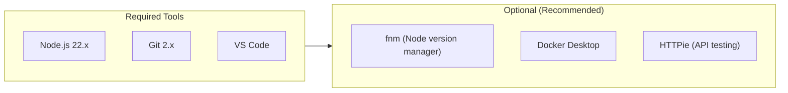
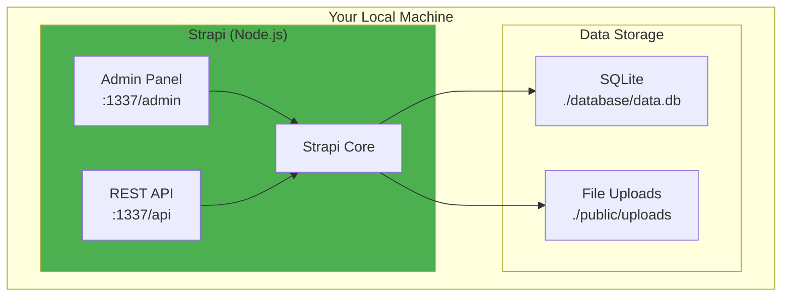
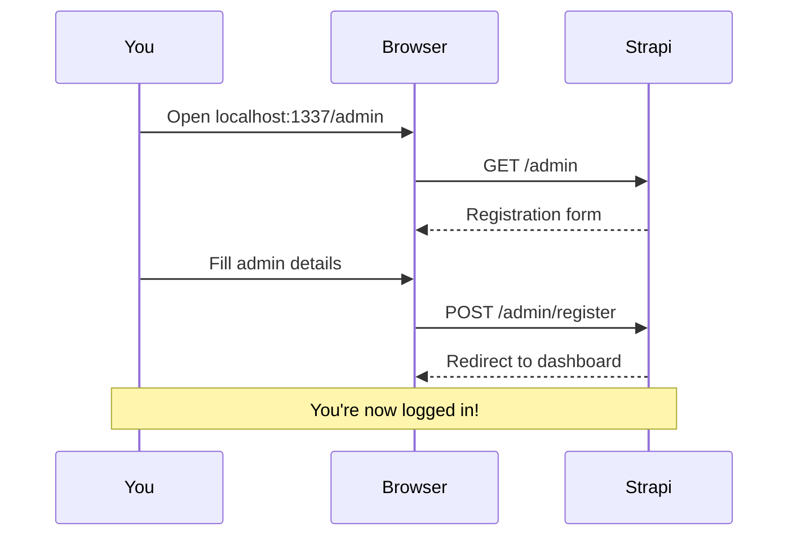
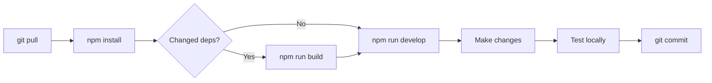

# Local Development Setup Guide

> **Audience:** DevOps Interns
> **Time Required:** 30-45 minutes
> **Difficulty:** Beginner

This guide walks you through setting up Autograph locally on your machine.

---

## Table of Contents

1. [Prerequisites](#prerequisites)
2. [Installation Steps](#installation-steps)
3. [Understanding the Stack](#understanding-the-stack)
4. [Configuration](#configuration)
5. [Running the Application](#running-the-application)
6. [Verification](#verification)
7. [Development Workflow](#development-workflow)
8. [Next Steps](#next-steps)

---

## Prerequisites

### Required Tools



### 1. Node.js (Required)

**Why Node.js 22?** Strapi 5 requires Node.js 20-24. We use v22 as it's the latest LTS.

#### Option A: Using fnm (Recommended)

```bash
# Install fnm (Fast Node Manager)
curl -fsSL https://fnm.vercel.app/install | bash

# Restart your terminal, then:
fnm install 22
fnm use 22

# Verify
node --version  # Should show v22.x.x
```

#### Option B: Direct Installation

Download from [nodejs.org](https://nodejs.org/en/download/)

#### Option C: Using Homebrew (macOS)

```bash
brew install node@22
```

### 2. Git (Required)

```bash
# macOS
brew install git

# Ubuntu/Debian
sudo apt install git

# Verify
git --version  # Should show 2.x.x
```

### 3. Code Editor (Required)

We recommend **VS Code** with these extensions:

| Extension | Purpose |
|-----------|---------|
| ESLint | JavaScript linting |
| Prettier | Code formatting |
| GitLens | Git integration |
| REST Client | API testing |

### 4. Optional Tools

```bash
# HTTPie - Better curl for API testing
brew install httpie

# Docker - For containerized development
brew install --cask docker

# jq - JSON processor
brew install jq
```

---

## Installation Steps

### Step 1: Clone the Repository

```bash
# Using SSH (recommended if you have SSH keys set up)
git clone git@github.com:PearlThoughtsInternship/Autograph.git

# Or using HTTPS
git clone https://github.com/PearlThoughtsInternship/Autograph.git

# Navigate to the project
cd Autograph
```

### Step 2: Set Node.js Version

```bash
# If using fnm
fnm use 22

# Verify
node --version
# Expected: v22.x.x
```

### Step 3: Install Dependencies

```bash
cd backend
npm install
```

**What's happening?** npm reads `package.json` and downloads all required packages to `node_modules/`.

<details>
<summary>📦 Key Dependencies Explained</summary>

| Package | Purpose |
|---------|---------|
| `@strapi/strapi` | Core Strapi framework |
| `better-sqlite3` | SQLite database driver |
| `react`, `react-dom` | Admin panel UI |
| `typescript` | Type checking |

</details>

### Step 4: Build the Admin Panel

```bash
npm run build
```

**What's happening?** This compiles the React-based admin panel. Required on first run and after admin customizations.

**Expected output:**
```
- Compiling TS
✔ Compiling TS (679ms)
- Building build context
✔ Building build context (92ms)
- Building admin panel
✔ Building admin panel (10415ms)
```

### Step 5: Start the Development Server

```bash
npm run develop
```

**Expected output:**
```
[INFO] Starting Strapi application...
[INFO] Admin panel: http://localhost:1337/admin
[INFO] Server is running on http://localhost:1337
```

---

## Understanding the Stack



### Port Usage

| Port | Service | URL |
|------|---------|-----|
| 1337 | Strapi | http://localhost:1337 |
| 7700 | Meilisearch (future) | http://localhost:7700 |
| 6379 | Redis (future) | localhost:6379 |

---

## Configuration

### Environment Variables

Strapi uses a `.env` file for configuration. A file was auto-generated during setup:

```bash
# View current configuration
cat backend/.env
```

**Key variables explained:**

| Variable | Description | Default |
|----------|-------------|---------|
| `HOST` | Server host | `0.0.0.0` |
| `PORT` | Server port | `1337` |
| `APP_KEYS` | Security keys for sessions | Auto-generated |
| `API_TOKEN_SALT` | Salt for API tokens | Auto-generated |
| `ADMIN_JWT_SECRET` | JWT secret for admin | Auto-generated |
| `JWT_SECRET` | JWT secret for users | Auto-generated |

### Database Configuration

Located in `backend/config/database.ts`:

```typescript
// Development uses SQLite (zero configuration)
connection: {
  client: 'better-sqlite3',
  filename: '.tmp/data.db'
}

// Production will use PostgreSQL
// See docs/CLOUD-DEPLOYMENT.md
```

---

## Running the Application

### Available Commands

```bash
# Development mode (with hot reload)
npm run develop

# Production mode (after build)
npm run start

# Build admin panel
npm run build

# Strapi console (REPL)
npm run console
```

### Development Mode Features

| Feature | Description |
|---------|-------------|
| **Hot Reload** | Server restarts on file changes |
| **Admin Rebuild** | Admin panel rebuilds on changes |
| **Debug Logging** | Verbose logging enabled |

---

## Verification

### 1. Health Check

```bash
# Using curl
curl http://localhost:1337/_health

# Using HTTPie
http GET localhost:1337/_health

# Expected: HTTP 204 (No Content) - means healthy
```

### 2. Admin Panel

Open http://localhost:1337/admin in your browser.

**First-time setup:**
1. Create your admin account
2. Fill in email, password, and name
3. Click "Let's start"



### 3. API Endpoint

```bash
# List all content types (empty initially)
http GET localhost:1337/api

# Expected response:
# HTTP/1.1 404 Not Found (no content types yet)
```

---

## Development Workflow

### Daily Workflow



### Creating a Content Type

1. Open Admin Panel → Content-Type Builder
2. Click "Create new collection type"
3. Name it (e.g., "Article")
4. Add fields:
   - `title` (Text, required)
   - `content` (Rich text)
   - `slug` (UID, from title)
5. Save and restart

### Making API Requests

```bash
# After creating "Article" content type:

# List articles
http GET localhost:1337/api/articles

# Create article (requires API token)
http POST localhost:1337/api/articles \
  Authorization:"Bearer YOUR_API_TOKEN" \
  data:='{"title": "Hello World", "content": "My first article"}'
```

---

## Project File Reference

### Key Files to Know

| File | Purpose |
|------|---------|
| `backend/package.json` | Dependencies and scripts |
| `backend/.env` | Environment variables |
| `backend/config/database.ts` | Database configuration |
| `backend/config/server.ts` | Server settings |
| `backend/config/admin.ts` | Admin panel settings |
| `backend/src/api/` | Your content type APIs |

### Generated Files (Don't Edit)

| Location | Purpose |
|----------|---------|
| `backend/node_modules/` | Dependencies |
| `backend/build/` | Compiled admin panel |
| `backend/.cache/` | Build cache |
| `backend/database/` | SQLite database |

---

## Next Steps

Now that you have Autograph running locally:

1. 📖 **Create your first content type** - Article with title, content, author
2. 🔌 **Test the API** - Use HTTPie or Postman to query your content
3. 🔧 **Read [Troubleshooting](TROUBLESHOOTING.md)** - Common issues and fixes
4. ☁️ **Review [Cloud Deployment](CLOUD-DEPLOYMENT.md)** - Understand production setup
5. 📚 **Follow [Learning Path](LEARNING-PATH.md)** - Curated resources

---

## Quick Reference Card

```bash
# Start development
cd backend && npm run develop

# Build admin
npm run build

# Check health
curl localhost:1337/_health

# View logs
# (logs appear in terminal running npm run develop)

# Reset database (⚠️ deletes all data)
rm -rf backend/.tmp backend/database

# Update dependencies
npm update
```

---

<div align="center">

**Need help?** Check [Troubleshooting](TROUBLESHOOTING.md) or ask in #devops-internship

</div>
