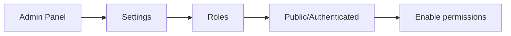

# Troubleshooting Guide

> **Audience:** DevOps Interns
> **Purpose:** Solutions to common issues

This guide covers the most frequent issues you'll encounter and their solutions.

---

## Table of Contents

1. [Installation Issues](#installation-issues)
2. [Runtime Errors](#runtime-errors)
3. [Database Issues](#database-issues)
4. [Build Failures](#build-failures)
5. [API Issues](#api-issues)
6. [Performance Issues](#performance-issues)
7. [Docker Issues](#docker-issues)
8. [Getting Help](#getting-help)

---

## Quick Diagnostic

Run this to check your environment:

```bash
# Check Node version
node --version  # Expected: v20.x - v24.x

# Check npm
npm --version   # Expected: 8.x+

# Check if Strapi port is in use
lsof -i :1337

# Check disk space
df -h .

# Check memory
free -m  # Linux
vm_stat  # macOS
```

---

## Installation Issues

### ❌ Error: `npm install` fails with EACCES

**Symptoms:**
```
npm ERR! Error: EACCES: permission denied
```

**Cause:** npm trying to install globally without permissions.

**Solution:**
```bash
# Fix npm permissions
mkdir -p ~/.npm-global
npm config set prefix '~/.npm-global'
echo 'export PATH=~/.npm-global/bin:$PATH' >> ~/.zshrc
source ~/.zshrc

# Retry installation
npm install
```

---

### ❌ Error: `node: command not found`

**Symptoms:**
```bash
$ node --version
zsh: command not found: node
```

**Cause:** Node.js not installed or not in PATH.

**Solution:**
```bash
# If using fnm
eval "$(fnm env)"
fnm use 22

# Or install Node.js
brew install node@22
```

---

### ❌ Error: `better-sqlite3` compilation fails

**Symptoms:**
```
npm ERR! better-sqlite3@11.x.x build: node-gyp rebuild
npm ERR! gyp ERR! build error
```

**Cause:** Missing build tools for native modules.

**Solution (macOS):**
```bash
xcode-select --install
npm rebuild better-sqlite3
```

**Solution (Linux):**
```bash
sudo apt install build-essential python3
npm rebuild better-sqlite3
```

---

### ❌ Error: Wrong Node.js version

**Symptoms:**
```
error @strapi/strapi@5.x: The engine "node" is incompatible with this module.
Expected version ">=20.0.0 <=24.x.x". Got "18.x.x"
```

**Cause:** Using an unsupported Node.js version.

**Solution:**
```bash
# Using fnm
fnm install 22
fnm use 22

# Verify
node --version  # Should show v22.x.x

# Reinstall dependencies
rm -rf node_modules package-lock.json
npm install
```

---

## Runtime Errors

### ❌ Error: Port 1337 already in use

**Symptoms:**
```
Error: listen EADDRINUSE: address already in use :::1337
```

**Cause:** Another process is using port 1337.

**Solution:**
```bash
# Find what's using the port
lsof -i :1337

# Kill the process (replace PID)
kill -9 <PID>

# Or use a different port
PORT=1338 npm run develop
```

---

### ❌ Error: `strapi: command not found`

**Symptoms:**
```bash
$ npm run develop
sh: strapi: command not found
```

**Cause:** Dependencies not installed or corrupted.

**Solution:**
```bash
# Clean install
rm -rf node_modules package-lock.json
npm install

# Verify strapi is installed
ls node_modules/.bin/strapi
```

---

### ❌ Error: Admin panel shows blank page

**Symptoms:** Browser shows white screen at `/admin`

**Cause:** Admin panel not built or build is corrupted.

**Solution:**
```bash
# Rebuild admin panel
npm run build

# Clear browser cache and refresh
# Or try incognito mode
```

---

### ❌ Error: `secretOrPrivateKey must have a value`

**Symptoms:**
```
Error: secretOrPrivateKey must have a value
```

**Cause:** Missing JWT secrets in `.env`

**Solution:**
```bash
# Check .env file exists
cat .env

# If missing, create from example
cp .env.example .env

# Generate new secrets
node -e "console.log(require('crypto').randomBytes(32).toString('base64'))"
# Add output to APP_KEYS, JWT_SECRET, etc.
```

---

## Database Issues

### ❌ Error: Database is locked

**Symptoms:**
```
Error: SQLITE_BUSY: database is locked
```

**Cause:** Multiple processes accessing SQLite simultaneously.

**Solution:**
```bash
# Stop all Strapi processes
pkill -f strapi

# Remove lock file if exists
rm -f backend/.tmp/data.db-shm backend/.tmp/data.db-wal

# Restart
npm run develop
```

---

### ❌ Error: Cannot find table

**Symptoms:**
```
error: relation "content_types" does not exist
```

**Cause:** Database schema out of sync.

**Solution:**
```bash
# For development (⚠️ loses data)
rm -rf backend/.tmp

# Restart - Strapi will recreate schema
npm run develop
```

---

### ❌ Reset database completely

**When to use:** Starting fresh or corrupted database.

```bash
# Stop Strapi first
# Then remove all database files
rm -rf backend/.tmp
rm -rf backend/database

# Restart
npm run develop
# You'll need to create a new admin user
```

---

## Build Failures

### ❌ Error: Build fails with memory error

**Symptoms:**
```
FATAL ERROR: Ineffective mark-compacts near heap limit Allocation failed
```

**Cause:** Node.js running out of memory.

**Solution:**
```bash
# Increase Node.js memory limit
NODE_OPTIONS="--max-old-space-size=4096" npm run build
```

---

### ❌ Error: TypeScript compilation errors

**Symptoms:**
```
TS2307: Cannot find module '@strapi/strapi'
```

**Cause:** TypeScript types not installed.

**Solution:**
```bash
# Reinstall with dev dependencies
npm install

# Rebuild
npm run build
```

---

## API Issues

### ❌ Error: 401 Unauthorized

**Symptoms:**
```json
{
  "error": {
    "status": 401,
    "message": "Unauthorized"
  }
}
```

**Cause:** Missing or invalid API token.

**Solution:**

1. Go to Admin → Settings → API Tokens
2. Create a new token with appropriate permissions
3. Use in requests:

```bash
http GET localhost:1337/api/articles \
  Authorization:"Bearer YOUR_TOKEN_HERE"
```

---

### ❌ Error: 403 Forbidden

**Symptoms:**
```json
{
  "error": {
    "status": 403,
    "message": "Forbidden"
  }
}
```

**Cause:** Permissions not configured.

**Solution:**

1. Go to Admin → Settings → Roles
2. Edit "Public" role
3. Enable permissions for your content type (find, findOne, etc.)



---

### ❌ Error: 404 Not Found on API

**Symptoms:**
```json
{
  "error": {
    "status": 404,
    "message": "Not Found"
  }
}
```

**Cause:** Wrong endpoint or content type not published.

**Solution:**
```bash
# Correct endpoint format:
# /api/{plural-content-type-name}

# For "Article" content type:
http GET localhost:1337/api/articles  # ✅ Correct
http GET localhost:1337/api/article   # ❌ Wrong (singular)
```

---

## Performance Issues

### ❌ Slow development server startup

**Cause:** Large node_modules or slow disk.

**Solution:**
```bash
# Clear caches
rm -rf backend/.cache
rm -rf backend/node_modules/.cache

# Use faster package manager (optional)
npm install -g pnpm
pnpm install
```

---

### ❌ High memory usage

**Cause:** Memory leaks or large datasets.

**Solution:**
```bash
# Check memory usage
ps aux | grep node

# Restart Strapi periodically
# Or increase swap space (Linux)
sudo fallocate -l 2G /swapfile
sudo chmod 600 /swapfile
sudo mkswap /swapfile
sudo swapon /swapfile
```

---

## Docker Issues

### ❌ Error: Container won't start

**Symptoms:**
```
docker: Error response from daemon: Conflict.
```

**Solution:**
```bash
# Remove existing container
docker rm -f autograph-strapi

# Rebuild and start
docker-compose up --build
```

---

### ❌ Error: Volume permission denied

**Solution:**
```bash
# Fix permissions
sudo chown -R $(id -u):$(id -g) ./backend

# Or use namespaced volumes
docker-compose down -v
docker-compose up
```

---

## Environment-Specific Issues

### macOS

| Issue | Solution |
|-------|----------|
| Xcode tools missing | `xcode-select --install` |
| Port in use | `lsof -i :1337` then `kill -9 <PID>` |
| fsevents warning | Safe to ignore |

### Linux (Ubuntu/Debian)

| Issue | Solution |
|-------|----------|
| Build tools missing | `sudo apt install build-essential` |
| Python missing | `sudo apt install python3` |
| Permission denied | `sudo chown -R $USER:$USER .` |

### Windows (WSL2)

| Issue | Solution |
|-------|----------|
| File watching broken | Use WSL2 filesystem, not `/mnt/c` |
| Slow npm install | Move project to WSL2 home directory |
| Line endings | `git config core.autocrlf input` |

---

## Diagnostic Commands

### System Information

```bash
# Node.js
node --version
npm --version
which node

# System
uname -a
cat /etc/os-release  # Linux
sw_vers              # macOS

# Disk
df -h .

# Memory
free -m              # Linux
vm_stat              # macOS

# Ports
lsof -i :1337
netstat -tlnp | grep 1337  # Linux
```

### Strapi Diagnostics

```bash
# Check Strapi version
cat backend/package.json | grep strapi

# Verify installation
ls -la backend/node_modules/.bin/strapi

# Check environment
cat backend/.env

# View logs
# (run in separate terminal)
tail -f backend/strapi.log 2>/dev/null || echo "No log file"
```

---

## Getting Help

### Before Asking for Help

1. ✅ Check this troubleshooting guide
2. ✅ Search existing issues on GitHub
3. ✅ Google the error message
4. ✅ Check Strapi documentation: https://docs.strapi.io

### How to Ask for Help

Provide this information:

```markdown
**Environment:**
- OS: macOS 14.x / Ubuntu 22.04 / Windows 11 WSL2
- Node: v22.x.x
- npm: 10.x.x

**Steps to reproduce:**
1. First I did...
2. Then I tried...
3. Error occurred when...

**Error message:**
```
<paste full error here>
```

**What I've tried:**
- Tried solution A from troubleshooting guide
- Googled and found X
```

### Support Channels

| Channel | Best For |
|---------|----------|
| #devops-internship Slack | Quick questions |
| GitHub Issues | Bug reports, feature requests |
| Strapi Discord | Strapi-specific questions |
| Stack Overflow | General programming questions |

---

## Quick Fixes Cheatsheet

```bash
# Most common fixes in order:

# 1. Restart Strapi
npm run develop

# 2. Rebuild admin
npm run build

# 3. Clear caches
rm -rf backend/.cache backend/node_modules/.cache

# 4. Reinstall dependencies
rm -rf node_modules package-lock.json && npm install

# 5. Reset database (⚠️ loses data)
rm -rf backend/.tmp backend/database

# 6. Nuclear option - fresh start
cd .. && rm -rf Autograph && git clone ... && npm install
```

---

<div align="center">

**Still stuck?** Post in #devops-internship with your error details

</div>
